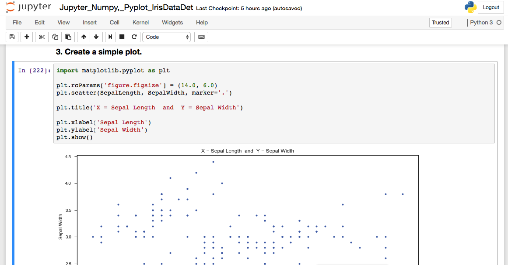

# Jupyter Notebook

The Jupyter notebook is a web-based notebook environment for interactive
computing.

### Jupyter notebook, the language-agnostic evolution of IPython notebook
Jupyter notebook is a language-agnostic HTML notebook application for
Project Jupyter. In 2015, Jupyter notebook was released as a part of
The Big Split™ of the IPython codebase. IPython 3 was the last major monolithic
release containing both language-agnostic code, such as the *IPython notebook*,
and language specific code, such as the *IPython kernel for Python*. As
computing spans across many languages, Project Jupyter will continue to develop the
language-agnostic **Jupyter notebook** in this repo and with the help of the
community develop language specific kernels which are found in their own
discrete repos.

## Installation
You can find the installation documentation for the
[Jupyter platform, on ReadTheDocs](https://jupyter.readthedocs.io/en/latest/install.html).
The documentation for advanced usage of Jupyter notebook can be found
[here](https://jupyter-notebook.readthedocs.io/en/latest/).

For a local installation, make sure you have
[pip installed](https://pip.readthedocs.io/en/stable/installing/) and run:

    $ pip install notebook

## Usage - Running Jupyter notebook

### Running in a local installation

At folder launch with:

    $ jupyter notebook

# Problem set: Jupyter, pyplot and numpy

These problems relate to Jupyter, numpy, and pyplot. We will use the famous iris data set. Save your work as a single Jupyter notebook file in a GitHub repository. Include any required data files, a README, and a gitignore file in the repository.

## 1. Get and load the data

Search online for Fisher’s iris data set, find a copy of the data, download it and save it to your repository. If it is not in CSV format, use whatever means (Excel, notepad++, visual studio code, python) to convert it to CSV and save the CSV version to your repository also. Open your Jupyter notebook for this problem sheet, creating a new one if needed, and load the CSV file into a numpy array.

## 2. Write a note about the data set

In a markdown cell at the start of your notebook, write a short description of the iris data set, complete with references.

## 3. Create a simple plot

The dataset contains five variables: sepal length, sepal width, petal length, petal width, and species. Use pyplot to create a scatter plot of sepal length on the x-axis versus sepal width on the y-axis. Add axis labels and a title to the plot.

## 4. Create a more complex plot

Re-create the above plot, but this time plot the setosa data points in red, the versicolor data point in green, and the virginica data points in blue. Setosa, versicolor, and virginica are the three possible values of the species variable. Add a legend to the plot showing which species is in which colour.

## 5. Use seaborn

Use the seaborn library to create a scatterplot matrix of all five variables.

## 6. Fit a line

Fit a straight line to the variables petal length and petal width for the whole data set. Plot the data points in a scatter plot with the best fit line shown.

## 7. Calculate the R-squared value

Calculate the R-squared value for your line above.

## 8. Fit another line

Use numpy to select only the data points where species is setosa. Fit a straight line to the variables petal length and petal width. Plot the data points in a scatter plot with the best fit line shown.

## 9. Calculate the R-squared value

Calculate the R-squared value for your line above.

## 10. Use gradient descent
